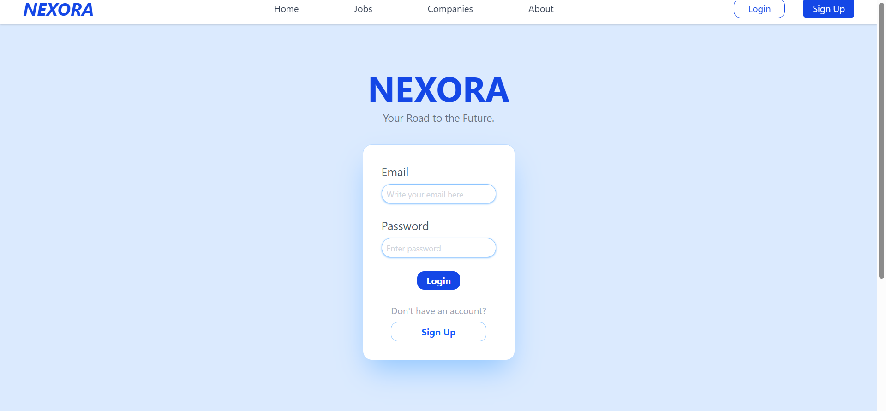
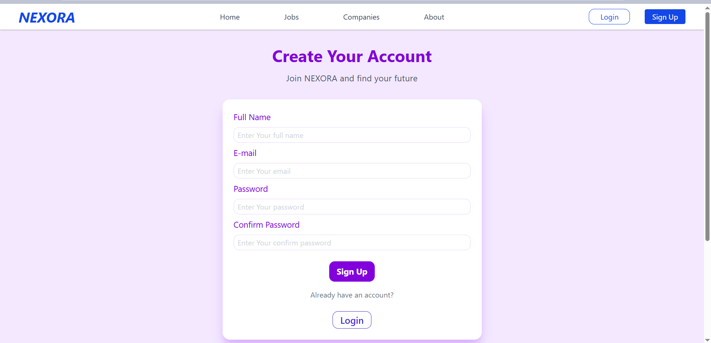
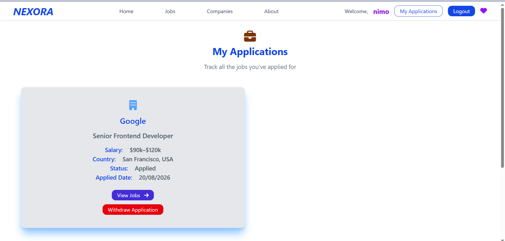
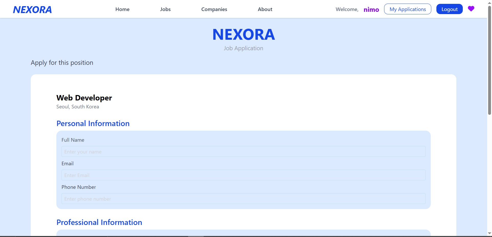
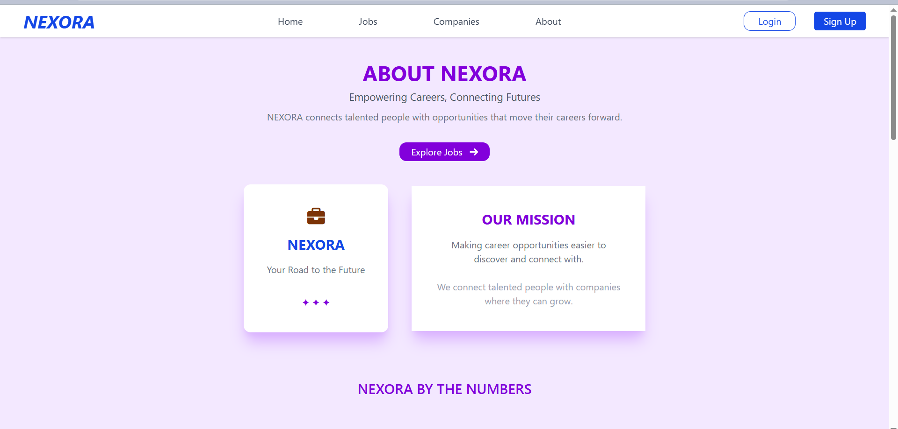

# 🌟 Frontend Portfolio – [Amna Bint E Rasheed]

## 👋 About Me 👋

My name is **Amna**, and I completed my *Associate Degree in Computer Science* in 2023.  
I am currently preparing for the **GKS Undergraduate 2027** while learning and practicing frontend development skills.
My aim is to became a software engineer under the guaidance of honorable professor.  
I started learning frontend development through YouTube tutorials, but I believe real growth comes from guided teaching.There are still so many things that i did not learn yet.That’s why I am preparing for the GKS — to learn directly from professors and gain knowledge beyond what online tutorials can cover. I am passionate about building modern reliable and responsive websites.and I created this GitHub portfolio to showcase some of my best projects and the skills I have developed through hands-on practice.Along the way, I have also earned two freeCodeCamp certificates, which strengthened my foundation in web development.

- 🌐 Frontend Developer focused on creating user‑friendly interfaces with clean code  
- ⚡ Skilled in **HTML**, **CSS**, **JavaScript**, **React**, and **TailwindCSS** .... 
- 🎓 Certified in freeCodeCamp courses: *Responsive Web Design* and *JavaScript Algorithms & Data Structures*  
- 🎯 Dedicated to learning, growing, and contributing to innovative projects

--------------------------------------

##  Featured Projects 🚀

---------------------------------------------
-----------------------------------------------

## . Job-Portal 

- About:
  - NEXORA is a modern job portal built with React and Tailwind CSS, designed to help job seekers discover and explore career opportunities through a clean and user-friendly interface. Users can search and filter jobs, view detailed job information, explore companies, save jobs and companies, and submit job applications with their CV.
  The My Applications page allows users to view all the jobs they have applied for in one place.
  The project focuses on creating a complete and practical job-seeking experience while demonstrating modern frontend development with React.

- Screenshot: Here's take a quick preview:
     - Home Page
    

     - Login Page
    

     - Signup Page
    

     - Jobs Page
    

     - Job-Details Page
    

     - Companies Page
    

     - Company-Details Page
    

     - My-Applications Page
    

     - Job-Applications Page
    

     - Popular-Category Page
    

     - About Page
    

     - Save-Company Page
    

     - save-Jobs Page
    

     - How-It-Work
    

- Git clone Repository
    - git clone https://github.com/Amnaakhtar1213/job-portal.git

--------------------------------------------------------
---------------------------------------

## . Task-Manager 🗂️

- About:
  - A modern Employee Task Management System built with **React.js**, **Tailwind CSS**, **Context API**, and **Local Storage**. It features separate **Admin** and **Employee** dashboards, secure role-based login, task assignment, real-time task counter updates, and persistent data storage. This project helped me strengthen my understanding of React components, state management, Context API, authentication flow, and building real-world frontend applications.

- Screenshot: Here's take a quick preview:
     - [Click here for *loggin page* screenshot](./Screenshots/proj-1.png)
     - [Click here for *admin-dashboard* page screenshot](./Screenshots/proj-3.png)
     - [Click here for *employee-dashboard* page screenshot](./Screenshots/proj-2.png)

- Live Demo: Here's you take a quick test yourself:
    - [Click here for *musinsa* clone live-demo to experience yourself](https://amnaakhtar1213.github.io/task-manager/)

- Git clone Repository
   -  git clone https://github.com/Amnaakhtar1213/task-manager.git
 
----------------------------------------
-------------------------------------------------

## . Musinsa (E‑Commerce) Clone 🛍️

- About:
    - A modern, responsive e‑commerce web application inspired by **Musinsa**, built with **React** and **Tailwind CSS**.This project demonstrates dynamic product rendering, interactive favorites and cart functionality, and scalable architecture suitable for large product catalogs.Its also has a dedicated brand page, responsive search bar, dropdown menu  and has a 5,6 pages with different products.After confirming order in cart there is a success msg appear with confetti celebration.I made this website on my own after learning from utube.

- Screenshot: Here's take a quick preview:
     - [Click here for *musinsa navbar dropdown* screenshot](./Screenshots/proj-4d.png)
     - [Click here for *musinsa home* page screenshot](./Screenshots/proj-4a.png)
     - [Click here for *musinsa wishlist* page screenshot](./Screenshots/proj-4b.png)
     - [Click here for *musinsa cart* page screenshot](./Screenshots/proj-4c.png)

- Live Demo: Here's you take a quick test yourself:
    - [Click here for *musinsa* clone live-demo to experience yourself](https://amnaakhtar1213.github.io/Musinsa-clone/)

- Git clone Repository
   -  git clone https://github.com/Amnaakhtar1213/musinsa.git
 
----------------------------------------
-------------------------------------------------

## . Weather-App 🌦️

- About:
    - A simple weather app that let you know about current weather.It display temperature, humidity, weather description and it also show weather emoji.Here i use *[openWeatherMap API]*. 

- Screenshot: Here's take a quick preview:
    - [Click here for screenshot](./Screenshots/proj-5.png)

- Live Demo: Here's you take a quick test yourself:
    - [Click here for live-demo](https://amnaakhtar1213.github.io/weather-app/)

- Git clone Repository
   -  git clone https://github.com/Amnaakhtar1213/weather-app.git
 
----------------------------------------
-------------------------------------------------

## . GALLERY-PROJECT [API CALLING] 🙍‍♀️🙍‍♂️🧏‍♀️

- About: 
   - This is gallery application made with *REACT* AND *TAILWIND*.here i pracitcs how to use useEffect and how to  use api calling and handling his data.  

- Screenshots: Here's take a quick preview:
   - [Click here for screenshot](./Screenshots/proj-6.png)

- Live Demo: Here you take a quick test yourself:
   -  [Click here for live-demo](https://amnaakhtar1213.github.io/gallery-project/)

- Git clone Repository
   -   git clone https://github.com/Amnaakhtar1213/gallery-project.git
--------------------------------------------------------------
-------------------------------------------------------------

## .  Recipe-Finder 👩‍🍳 🍽️

- About:
    - A simple web application that lets users search for recipes using TheMealDB API. Users can search meals or even only one item by name and the bunch of recipes are there.You should select and cook. 

- Screenshot: Here's take a quick preview:
    - [Click here for screenshot](./Screenshots/proj-7.png)

- Live Demo: Here's you take a quick test yourself:
    - [Click here for live-demo](https://amnaakhtar1213.github.io/recipe-finder/)

- Git clone Repository
   -  git clone https://github.com/Amnaakhtar1213/recipe-finder.git
 
----------------------------------------
-------------------------------------------------

## . GitHub User-Finder 🔎

- About:
   - Its allow you to find any user on github using the Github REST API.It built with the *HTML*, *CSS* and *JavaScript*.

- Screenshots: Here's take a quick preview:
   - [Click here for screenshot](./Screenshots/proj-8.png)
 
- Live Demo: Here you take a quick test yourself:
   -  [Click here for live-demo](https://amnaakhtar1213.github.io/github-user-finder/)

- Git clone Repository
   -  git clone https://github.com/Amnaakhtar1213/github-user-finder.git

-------------------------------------------
---------------------------------------------

## . Currency Converter 💵

- About:
   - A currency-converter app that let the user enter amount and choose which currency he wanted to convert it .I use free API here , Exchangerates-free API.

- Screenshots: Here's take a quick look:
   - [Click here for screenshot](./Screenshots/proj-9.png)

- Live Demo: Here you take a quick test yourself:
   -  [Click here for live-demo](https://amnaakhtar1213.github.io/currency-converter/)

- Git clone Repository
   - git clone https://github.com/Amnaakhtar1213/currency-converter.git

----------------------------------------------------------------
-------------------------------------------------------------------

## . TO-DO app (**REACT**) 📝

- About: 
   - A Simple, clean and interactive todo list application built with *HTML*, *CSS* and *JAVASCRIPT*.It help you to add, manage and filter tasks while keeping the track of what's left.

- Screenshots: Here's take a quick preview:
   - [Click here for screenshot](./Screenshots/proj-10.png)

- Live Demo: Here you take a quick test yourself:
   -  [Click here for live-demo](https://amnaakhtar1213.github.io/to-do-app/)

- Git clone Repository
   -   git clone https://github.com/Amnaakhtar1213/to-do-app.git
--------------------------------------------------------------
---------------------------------------------------------------

## . Expense Tracker 📜

- About: 
    - A Expense tracker program that built with *JAVASCRIPT*.It let you add transaction, see your balance, and keep track of income and expense.All data is saved in local Storage, so your record stay even after the refresh.
    - Remember add expense with (-) sign 

- Screenshots: Here's take a quick preview:
   - [Click here for screenshot](./Screenshots/proj-11.png)
 
- Live Demo: Here you take a quick test yourself:
   -  [Click here for live-demo](https://amnaakhtar1213.github.io/expense-tracker/)

- Git clone Repository
   - git clone https://github.com/Amnaakhtar1213/expense-tracker.git

----------------------------------------------------------------
-------------------------------------------------------------------

## . Bookmark Saver 🏷️

- About: 
   - A simple web app to save, organize, and manage your favorite website links. Built with HTML, CSS, and JavaScript, using localStorage for persistence.

- Screenshots: Here's take a quick preview:
   - [Click here for screenshot](./Screenshots/proj-12.png)
 
- Live Demo: Here you take a quick test yourself:
   - [Click here for live-demo]( https://amnaakhtar1213.github.io/bookmark-saver/)

- Git clone Repository
  - git clone https://github.com/Amnaakhtar1213/bookmark-saver.git

----------------------------------------------------------
-------------------------------------------------------------

## . UI-Project 📜

- About: 
   - This project is a simple React homepage layout built with Vite + Tailwind CSS. It includes a Navbar for navigation. A Hero section with a headline and description and a Scrollable image section on the right side, where each image has a tag, a paragraph, and a button.

- Screenshots: Here's take a quick preview:
   - [Click here for screenshot](./Screenshots/proj-13.png)
 
- Live Demo: Here you take a quick test yourself:
   -  [Click here for live-demo](https://amnaakhtar1213.github.io/UI-project/)

- Git clone Repository
   -  git clone https://github.com/Amnaakhtar1213/UI-project.git
  
---------------------------
-------------------

## .  Pokemon Finder 🛸

- About: 
   - A small web app that allow you to search any POKEMON by its name. API , ASYNC/AWAIT IS USED 
Some famous POKEMON you search for are: 
  - pikachu,         
  - eevee,       
  - snorlax,       
  - lucario,        
  - dragonite,     
  - gengar,         
  - mewtwo,         
  - charmander,    
  - squirtle  
You can search from these....

- Screenshots: Here's take a quick preview:
   - [Click here for screenshot](./Screenshots/proj-14.png)
 
- Live Demo: Here you take a quick test yourself:
   -  [Click here for live-demo](https://amnaakhtar1213.github.io/pokemon-finder/)

- Git clone Repository
   -  git clone https://github.com/Amnaakhtar1213/pokemon-finder.git

-------------------------------------------------
--------------------------------------------------

## . E-Commerce  (shirt-store) 👕👔

- About:
    - A Single product e-commerce store, built with *html* , *css* and a little bit of *javascript*.It has a 4 pages includes homes, shop, contact, about us and blog.

- Screenshot: Here's take a quick preview:
    - [Click here for screenshot](./Screenshots/proj-15.png)

- Live Demo: Here's you take a quick test yourself:
    - [Click here for live-demo](https://amnaakhtar1213.github.io/mens-collection/)

- Git clone Repository
   -  git clone https://github.com/Amnaakhtar1213/mens-collection.git
 
----------------------------------------
------------------------------------------------- 

## . Taste of KOREA 🍜

- About:
    - This is a restaurant style menu website that i built it for practicing pagination. The site displays 20 KOREAN food items with names, price, and short descriptions.
It includes categories like breakfast, lunch, dinner, drinks and sweets which makes easy to browse.

- Screenshot: Here's take a quick preview:
    - [Click here for screenshot](./Screenshots/proj-25.png)

- Live Demo: Here's you take a quick test yourself:
    - [Click here for live-demo](https://amnaakhtar1213.github.io/cafe-menu/)

- Git clone Repository
   -  git clone https://github.com/Amnaakhtar1213/cafe-menu.git
 
----------------------------------------
------------------------------------------------- 

## . Mini Music-Playlist 🎤 🎶 💽 🎧

- About:
   - A playlist made by javascript and it has playlist of korean song tunes.It good to relax.

- Screenshots: Here's take a quick look:
   - [Click here for screenshot](./Screenshots/proj-16.png)

- Live Demo: Here you take a quick test yourself:
   -  [Click here for live-demo](https://amnaakhtar1213.github.io/mini-music-playlist/)

- Git clone Repository
   - git clone https://github.com/Amnaakhtar1213/mini-music-playlist.git

----------------------------------------------------------------
-------------------------------------------------------------------

## . Password Generator 🚧

- About: 
   - A simple, interactive password generator built with **HTML**, **CSS**, and **javascript**.It allow user to create secure password with customizable options and provides a strength meter to check the password quality.Final password also show strength on strength-bar in different color(Red, orange, Green).

- Screenshots: Here's take a quick preview:
   - [Click here for screenshot](./Screenshots/proj-17.png)
 
- Live Demo: Here you take a quick test yourself:
   -  [Click here for live-demo](https://amnaakhtar1213.github.io/password-generator/)

- Git clone Repository
   -  git clone https://github.com/Amnaakhtar1213/password-generator.git

-------------------------------------------------
--------------------------------------------------

## . OTP-GENERATOR 🔓

- About:
   - The OTP Generator is a simple React application that creates secure one‑time passwords (OTPs) for authentication or verification purposes. It demonstrates how React can be used to build interactive tools with dynamic state updates.

- Screenshots: Here's take a quick look:
   - [Click here for screenshot](./Screenshots/proj-18.png)

- Live Demo: Here you take a quick test yourself:
   -  [Click here for live-demo](https://amnaakhtar1213.github.io/OTP-generator/)

- Git clone Repository
   - git clone https://github.com/Amnaakhtar1213/OTP-generator.git

----------------------------------------------------------------
-------------------------------------------------------------------

## . TIC-TAC-TOE (**REACT**) Game 🎮

- About: 
     - my first game that i built using javascript and *REACT*. X and O are used to play the game ,alternative term, winner announce, and also has a reset button.It has a good appearance.You should experience yourself via live demo. Its fun playing .

- Screenshots: Here's take a quick preview:
   - [Click here for screenshot](./Screenshots/proj-19.png)

- Live Demo: Here you take a quick test yourself:
   -  [Click here for live-demo](https://amnaakhtar1213.github.io/react-tic-tac-toe/)

- Git clone Repository
   -   git clone https://github.com/Amnaakhtar1213/react-tic-tac-toe.git

--------------------------------------------------------------
---------------------------------------------------------------

## . Music-Player 🎵🎶

- About: 
   - Responsive mini music player featuring the Milano‑Cortina Winter Olympic 2026 anthem. Interactive visuals and themes bring the experience alive — WATCH IT, FEEL IT.

- Screenshots: Here's take a quick preview:
   - [Click here for screenshot](./Screenshots/proj-20.png)

- Live Demo: Here you take a quick test yourself:
   -  [Click and enjoy the winter-olympic anthem for KOREA via live-demo](https://amnaakhtar1213.github.io/music-player/)

- Git clone Repository
   -   git clone https://github.com/Amnaakhtar1213/mini-music-player.git 

--------------------------------------------------------------
-------------------------------------------------------------

## . Rock-Paper-Scissors Game 🎮

- About:
   - A simple web-based Rock-Paper-Scissors game built with **HTML**, **CSS**, and **JavaScript**. Players can choose Rock, Paper, or Scissors, and the computer will randomly select its choice. The game keeps records of scores and displays the result of each round.

- Screenshots: Here's take a quick preview:
   - [Click here for screenshot](./Screenshots/proj-21.png)

- Live Demo: Here you take a quick test yourself:
   - [Click here for live-demo](https://amnaakhtar1213.github.io/rock-paper-scissors/)

- Git clone Repository
   -  git clone https://github.com/Amnaakhtar1213/rock-paper-scissors.git

--------------------------------------------------------------
-------------------------------------------------------------

## . Temperature Converter 🥵

- About: 
   - A **temperature converter** is a utility tool that allows users to easily convert values between different temperature scales. It helps in switching measurements across commonly used units without manual calculation.
     - **Celsius (°C) ↔ Fahrenheit (°F)**
     - **Fahrenheit (°F) ↔ **Celsius (°C)**

- Screenshots: Here's take a quick preview:
   - [Click here for screenshot](./Screenshots/proj-22.png)
 
- Live Demo: Here you take a quick test yourself:
   -  [Click here for live-demo](https://amnaakhtar1213.github.io/temprature-converter/)

- Git clone Repository
   -  git clone https://github.com/Amnaakhtar1213/temprature-converter.git

-------------------------------------------------
--------------------------------------------------

## . Color-palette-generator 🎨

- About: 
   - A fun and interactive web app that give you a lots of color when you click (Generate Palette) button and also has a hex-code below the color-palette.

- Screenshots: Here's take a quick preview:
   - [Click here for screenshot](./Screenshots/proj-23.png)
 
- Live Demo: Here you take a quick test yourself:
   -  [Click here for live-demo](https://amnaakhtar1213.github.io/color-palette-generator/)

- Git clone Repository
   -  git clone https://github.com/Amnaakhtar1213/color-palette-generator.git

-----------------------------------------------------------------

## . Team Member showcase 👩🏼‍🤝‍👨🏻👭🏿

- About: 
   - A Modern, responsive team-member-showcase project built with *HTML* and *CSS*.This layout is perfect for portfolios, company websites, or project landing page where you want to highlight your team in a stylish, professional way..

- Screenshots: Here's take a quick preview:
   - [Click here for screenshot](./Screenshots/proj-24.png)
 
- Live Demo: Here you take a quick test yourself:
   -  [Click here for live-demo](https://amnaakhtar1213.github.io/team-member-showcase/)

- Git clone Repository
   -  git clone https://github.com/Amnaakhtar1213/team-member-showcase.git

-----------------------------------------------------------------

------------------------------------------------------------------

## Tech Stacks 🛠️

- **HTML**  
     - (For structure)
- **CSS**
     - (For styling, responsive layouts, animations)
- **JavaScript**
     - (For Interaction, managements)
- **REACT**
     - (useState, useEffect, Component)
- **Tailwind**
     - (utility-first-styling, responsive classes)
- **Git &GitHub**
     - (Version controls &Collaborations)
- **npm**
     - (package managements)
- **Vite**
     - (Fast building, Development Server)
  
-------------------------------------
-------------------------------------------------

 ## Certificates 🥇

- [freeCodeCamp Responsive Web Design CERTIFICATE](https://www.freecodecamp.org/certification/7777alex/responsive-web-design)
- [freeCodeCamp JAVASCRIPT CERTIFICATE](https://www.freecodecamp.org/certification/7777alex/javascript-v9)

 *SCREENSHOTS 📸

- [Click here for quick preview](./Screenshots/cert1.png) 
- [Click here for quick preview](./Screenshots/cert2.png)

-------------------------------------------
---------------------------------------------

  ##  Contact 📬

- **📧 Email:**  amnabinterasheed1911@gmail.com
- **🐙 GitHub:** [github.com/Amnaakhtar1213](https://github.com/Amnaakhtar1213)  
- **✖️ X (formerly Twitter):** [@amna4142](https://x.com/amna4142)
- **🎓 freeCodeCamp:** [Amna Bint‑e‑Rasheed (@7777alex)](https://www.freecodecamp.org/7777alex)